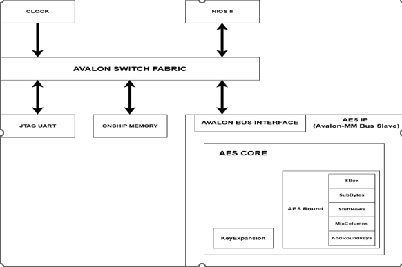
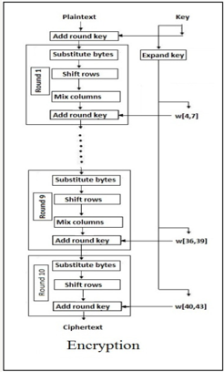

# AES Hardware Accelerator on SoPC (NIOS II) – DE10-Standard

##  Introduction
This repository contains a **System-on-a-Programmable-Chip (SoPC)** project developed for an SoC-related academic course.  
The system is implemented on the **DE10-Standard FPGA board** using **Intel Platform Designer (Qsys)** with an embedded **NIOS II processor**.

The main objective of this project is to **design, implement, and integrate a custom AES hardware accelerator IP** into a NIOS II–based SoPC system via the **Avalon Memory-Mapped (Avalon-MM) bus**.

The AES IP supports **AES-128, AES-192, and AES-256** encryption modes and is controlled by software running on the NIOS II processor.

---

##  Project Objectives
- Design a complete **SoPC system** using NIOS II
- Develop a **custom AES hardware IP**
- Integrate the IP using **Avalon-MM interface**
- Perform **HW/SW co-design**
- Understand performance trade-offs between software and hardware encryption

---

##  System Overview

The SoPC system consists of the following components:
- **NIOS II Processor** (pre-built, used as-is)
- **On-Chip Memory**
- **JTAG UART** for debugging and communication
- **Custom AES IP Core** (Avalon-MM Slave)
- **Avalon Switch Fabric**
- **System Clock**

The NIOS II processor acts as the system master and controls the AES IP by accessing memory-mapped registers.

---

##  SoPC Architecture

The figure below illustrates the overall **SoPC architecture** implemented on the DE10-Standard board.

- NIOS II communicates with peripherals via the Avalon Switch Fabric  
- AES IP is integrated as an **Avalon-MM Slave**
- On-chip memory stores program and data
- JTAG UART enables communication with the host PC



---

##  AES Hardware Accelerator

###  Supported Algorithms
- **AES-128** (10 rounds)
- **AES-192** (12 rounds)
- **AES-256** (14 rounds)

###  AES Core Architecture
The AES core is designed in a modular way and includes:
- SubBytes (S-Box)
- ShiftRows
- MixColumns
- AddRoundKey
- Key Expansion
- AES Round Control Logic

The design allows easy parameterization for different key sizes.

---

##  AES Encryption Workflow

The figure below shows the **AES encryption process**, including key expansion and round-based transformations.



---

## 🏗️ Project Structure

The following folders are included in this repository:
```
├── embeddedC/ # NIOS II software (C code, drivers, tests)
|
├── rtl/ # AES RTL source code (Verilog/VHDL)
|
├── system/ # Platform Designer (Qsys) system files
|
├── tb/ # Testbench and simulation files
|
├── references/ # Architecture & algorithm reference images
│ 
├── README.md
```


###  Folder Description

#### `embeddedC/`
- NIOS II application source code
- AES driver (register access)
- Test programs and validation code

#### `rtl/`
- AES core RTL implementation
- Avalon-MM slave interface
- Key size configurable logic (128/192/256)

#### `system/`
- Qsys / Platform Designer configuration
- SoPC integration files
- Address mapping and interconnect setup

#### `tb/`
- RTL testbench
- Functional verification
- Simulation scripts

#### `references/`
- System architecture diagrams
- AES algorithm workflow references

---

##  Tools & Environment

### ardware
- DE10-Standard FPGA Board

### Software
- Intel Quartus Prime
- Intel Platform Designer (Qsys)
- NIOS II Software Build Tools
- ModelSim / Questa (for simulation)

---

##  Verification & Testing
- RTL-level simulation using testbench
- Software-driven testing via NIOS II
- AES test vectors for correctness verification

---

##  Project Status

- [ ] AES RTL implementation
- [ ] Avalon-MM interface
- [ ] NIOS II software driver
- [ ] Functional verification
- [ ] Performance evaluation

---

##  Future Work
- Add interrupt support for AES completion
- Optimize throughput and latency
- Implement DMA-based data transfer
- Compare hardware vs software AES performance
- Power and area analysis

---

##  License
This project is developed for **academic and educational purposes** only.
